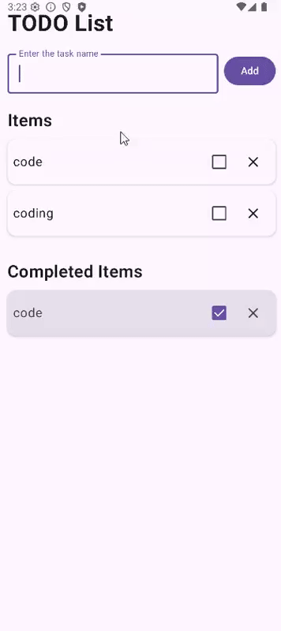
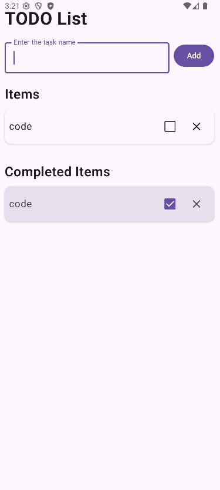
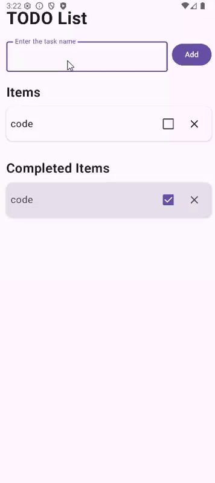
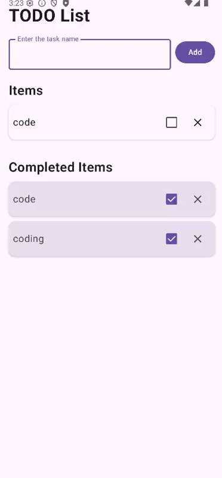

# To-Do List App

A basic and slick To-Do program written in Jetpack Compose on Android. In this application, the fundamental Android development concepts of data classes, state management, and contemporary UI design are showed.

## App Overview

This To-Do List application enables a user to work on their day-to-day activities in a clear and simple interface. The application has two primary sections, which include Active Items and Completed Items which is why it is easy to monitor the progress on tasks.



### Key Features
- **Add Tasks**: Add the names of tasks and put them in your active list.
- **Complete Tasks**: Cross tasks to transfer them to the completed part.
- **Delete Tasks**: Delete tasks in either section by a simple tap.
- **State Persistence**: State persists between changes in configuration such as screen rotation.
- **Input Validation**:  It eliminates the addition of empty tasks in a friendly way.
- **Empty States**: Displays nice messages when the sections are empty.

## Screenshots

### Main Interface
The app has two sections, active items and completed items. There is a checkbox to indicate completion and delete button on each task.


### Adding Tasks
The input field at the top helps users to add new tasks. The blank inputs will be checked by a toast message.



### Empty States
Where there are no sections, the app presents useful messages to guide the users.



## Concepts Used

### 1. Data Class
A data class is a special Kotlin class which is used to store data. The data class in this app is Todoitem that represents an item in the to-do list:

```kotlin
data class TodoItem(
    val id: Int,
    val text: String,
    val isCompleted: Boolean = false
)
```

**Why use data classes?**
- They automatically provide useful functions like `copy()`, `equals()`, and `toString()`
- Enhance the ability to form the inmutable objects having the default values in an easy manner.
- Excel-based and ideal in representing UI data in a nice, tidy manner.

### 2. State Management
State represents data that can change over time in your app. This app uses `mutableStateOf` to manage the UI state:

```kotlin
var todoItems by rememSave { mutableStateOf(listOf<TodoItem>()) }
var nextId by rememSave { mutableStateOf(1) }
```

**How state works:**
- `mutableStateOf` implements observable state, which causes UI updates.
- Compose automatically updates the UI when the state changes (so-called recomposition).
- `rememberSaveable` stores state between configuration changes such as screen rotation.

### 3. State Hoisting
State hoisting A state hoisting is a style in which you hoist state to a parent component and pass it down to children. This reuses and tests components:

```kotlin
// Parent component manages state
TodoApp() {
    // Child component receives state and callbacks
    AddItemSection(
        onAddItem = { text ->
            todoItems = todoItems + TodoItem(id = nextId, text = text)
            nextId++
        }
    )
}
```

**Benefits of state hoisting:**
- Makes child components stateless and reusable
- Parent is in charge of state, children only show it and report what happened.
- Enables unidirectional data flow: state flows down, events flow up
- Easier to test and debug

### 4. Composable Functions
The UI is built using composable functions marked with `@Composable`:

- `TodoApp()`: Main app structure and state management
- `AddItemSection()`: Input field and add button
- `TodoItemRow()`: Individual to-do item display
- `EmptyStateMessage()`: This is where there are no items.

**What are composables?**
- Functions that describe the UI
- Can be combined to build complex interfaces
- Reusable and testable
- Automatically update when state changes

## App Architecture

The app follows a simple but effective architecture:

1. **Data Layer**: `TodoItem` data class represents each task
2. **UI Layer**: Composable functions build the interface
3. **State Management**: Parent component manages state, children are stateless

```
TodoApp (Stateful)
├── AddItemSection (Stateless)
└── LazyColumn
    └── TodoItemRow (Stateless)
```

## Technical Details

- **Language**: Kotlin
- **UI Framework**: Jetpack Compose with Material 3
- **Minimum SDK**: API 24 (Android 7.0)
- **Target SDK**: API 36

## How to Build and Run

1. Clone this repository
2. Open the project in Android Studio
3. Sync Gradle dependencies
4. Run the app on an emulator or physical device


## Author

**An Nguyen**  
CPSC 411A - Mobile Device Appilcation Programming for Android

---


